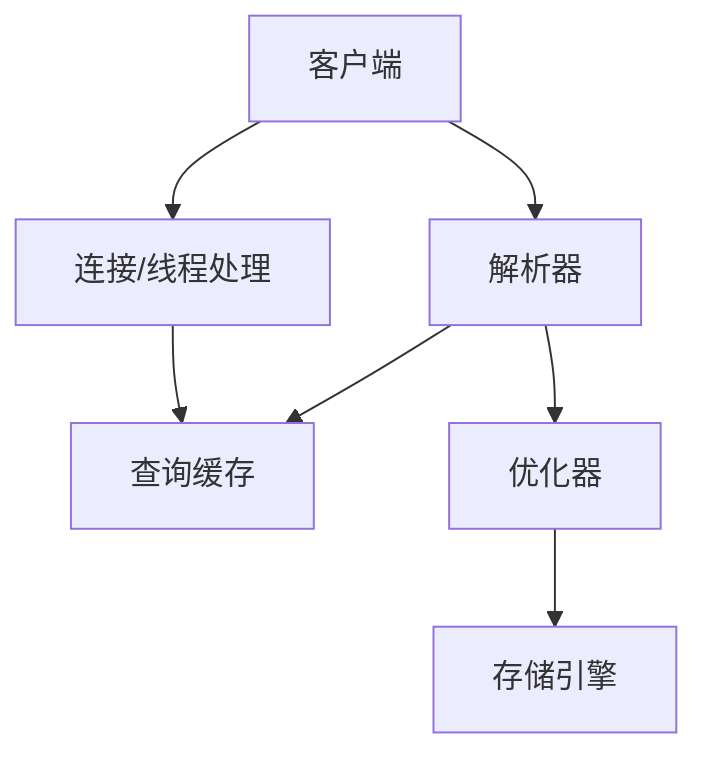

#  Database notebook

作业答案： https://wenku.baidu.com/view/69529f1aaf1ffc4ffe47acd9.html


### sql 

### **一、关系模型的三要素：**

- **关系数据结构**：关系模型中只包含单一的数据结构----关系，在用户看来关系模型中数据的逻辑结构是一张扁平的二维表

- **关系操作**（操作对象和结果都是集合）：

- - 查询：选择、投影、连接、并、差、交、笛卡尔积
  - 更新（插入、删除、修改）

- **关系的完整性约束**：

- - 实体完整性：主属性不能为空，主码不相等
  - 参照完整性：例如，学生（学号、姓名、专业号），专业（专业号，专业名），学生关系中的专业号需要参照专业关系中的专业号，称学生关系中的专业号是学生关系的外码，专业关系是被参照关系，学生关系为参照关系，外码与主码不一定要同名，学生关系中的外码取值要么为空值，要么为专业关系中对应专业号的值
  - 用户定义完整性：例如，学生的成绩取值范围在0~100之间

### **二、关系中涉及的基本概念**

**域**：一组具有相同数据类型的值的集合，例如：{0，1}、{男，女}

**候选码**：某一属性组的值能唯一地标识一个元组，而其子集不能的属性组

**主码**：若一个关系有多个候选码，则选定一个作为主码

**主属性**：候选码的诸属性

**非主属性（非码属性）**：不包含任何候选码中的属性

**全码**：关系模式的所有属性是这个关系模式的候选码

### mysql



#### 第一范式(1NF)

- 概念 数据表的每个字段(属性)必须是唯一的、不可分割的。
- 唯一性 比如：在一张学生信息表里不能有两个名称都是name的字段。
- 不可分割性 比如：在一张学生信息表不能出现类似name_mobile这样的字段，很明显name_mobile是可以分割成name和mobile两个字段的。

#### 第二范式(2NF)

- 概念 数据表的每条记录必须是唯一的(**主键约束**)，且非主键字段只依赖于主键。
- 唯一性 比如说：不能同时存在id ＝ 1的记录（id为主键）。
- 依赖性 比如说：在一张学生信息表（student_id为主键），不应该出现course_name(课程名称，依赖于course_id)这样的字段，因为，如果有一天，《心理健康教育》课程名要改成《心理健康教育杂谈》，就得改课程表和学生信息表的课程名称了。

#### 第三范式(3NF)

- 概念 数据表中不应该存在多余的字段，也就是说每个字段都不能由其他字段推理得到。
- 例子 比如说：学生信息表里不能同时存在province_id(省份ID)、city_id(城市ID)这两个字段，因为province_id可以由city_id推理得到

#### 逆范式

- 概念 就是不按照标准的范式去设计数据库
- 逆 在数据库的实践过程中，我们可能遇到数据量非常大的数据表，这时候去做join查询是非常损耗性能的，甚至导致数据库连接超时、挂掉等问题。所以呢，有时候就需要数据库多冗余设计，对一些字段做冗余，以避免大表之间的join。 


### Lec6 实体关系模型

#### Entity Sets

实体是一个对象， 可以是具体的，也可以是抽象的。

实体有属性attributes。 一个实体集包含多个同类实体

domain： 就是值域

一个联系集表示二个或多个实体集之间的关联 

#### super key
如果一个属性可以把不同的实体区分开，那它就是一个超码。
如果一个超码他任意的真子集都不能成为超码，那这样的最小超码就叫做候选码，candidate key , 最小的super key, 小一个就不能作为super key。

有箭头表示一对一, 没有箭头表示一对多

#### E-R 设计

若一个对象只对其名字及单值感兴趣，则可作为属性，如性别；

若一个对象除名字外，本身还有其他属性需描述，则该对象应定义为实体集。如电话, 部门
一个对象不能同时作为实体和属性. 
一个实体集不能与另一实体集的属性相关联，只能实体与实体相联系. 

(二个对象之间发生的动作 --- 用“relationship set”表示). 

例子， 画 e-r 图， 转化为relational schema。

联系可以具有描述性属性。
二元联系集就是涉及两个实体集的联系，及数据库中的大部分连线都是二元的，但是有一些实体集会多于两个。
参与联系集的实体集，它的数目也被叫做度。
复合属性它可以分为多个简单属性。
单值属性和多值属性，比如一个员工可以有一个或多个电话号码，所以就不同的员工实体在电话号码这个属性上就会有不同的值，这个属性就叫做多值属性。比方说一个员工可能有多个亲属。
映射基数：一个实体通过一个连续机能和多少个实体相关联。
派生属性： 这个属性的值可以从别的相关属性或实体中派生出来，比方说有一个贷款数量这个属性，那就可以从其他的数量当中计算出来。用来计算派生属性的就是基属性。派生属性的值不存储，但在需要的时候可以被计算出来。
主码应该选择从不变化或者极少变化的属性。 
联系集的主码怎么选择呢？如果是多对多的话，那就可以把两个实体集的**主码共同组成**，如果是多对1的话就选**一一对应的那个主码**。

##### 参与约束

如果每个实体都参与到联系集的至少一个联系中，我们称实体集全部参与联系。如果实体集中只有部分实体参与到联系集的联系中，就叫做部分参与联系集。这个画ER图很爱考。画双线就是全部参与。

#### 图符号

图是怎么画的呢？
画矩形：实体set
椭圆：属性
菱形：联系set
双椭圆：multivalued属性
虚线椭圆 ：派生属性derived attribute
双线 ： 一个实体集全部参与到联系集中。具体来说，实体集中的每一个实体都参与到联系集的至少一个联系当中。也可以在线上标注一下，来指定最小的映射基数到最大的映射基数
双矩形 ： weak实体集。
双菱形： 标识型联系。identifying relationship
箭头：只能是1对1或者多对1。箭头方向指的是1。
如果是1对1的话，那联系集出发的两条线都应该是箭头，一个箭头指向一个实体集。
如果有一些属性和联系集也是相关联的，那我们也要把这些属性用线段连在联系集上。

在菱形和矩形连线上面就可以标注上角色，比方说employee连到联系集上，然后可以标注一个worker。

在联系集外最多只允许有一个箭头，因为一个非二元，联系集外如果有两到更多个箭头的话，可能会存在两种解释，存在混淆。

#### 怎么看用实体还是用属性？

一个常见的错误是把一个实体集的主码作为另一个实体集的属性，比方说把客户的名字作为贷款的属性是不正确的。可能需要一个借贷人这个联系。这样可以明确的表示出两者之间的关系。
还有一个常见的错误是把实体集的主码属性作为联系集的属性。事实上在联系的表示中，已经隐含了这些主码属性。
怎么判断是用实体集还是用联系集呢？当描述发生在实体之间的行为的时候，就是一种联系集
数据库中的联系通常都是二元的，但其实也可以用多元的联系集。

1对1或者一对多联系集的属性。可以放到一个参与该联系的实体集中。这样联系集就不用存储这属性。

#### 弱实体集

 not have a primary key is referred to as a weak entity set. 

例子： 还贷登记表 payment(pay-num, pay-date, pay-amount). 假设为了清楚起见，pay-num按对应的每项贷款分别编号(都从1, 2, 3 …开始), 这样，pay-num就不是码，并且该实体集没有码。故payment是弱实体集。 pay-num is discriminator or partial key (分辨符或部分码). 

一个实体集，他没有足够的属性来形成主码。 主码的实体集就叫做强实体集。

弱实体集必须与另一个称为标识实体集或叫identifying  Entity set。和他关联才有意义，存在依赖于标识实体集。标识实体及 拥有它所标识的弱实体集把这它们之间的联系叫做标识行联系。
要实行联系，他是从弱实体集到标识实体集的，多对一联系，而且弱实体集全部参与联系。

它也需要一个分辨符，然后这个分辨符也叫做这个实体集的部分码
弱实体集的主码由标识实体集的主码和弱实体集的部分码共同组成。

#### 聚集

聚集是一种抽象，通过这种抽象联系被当做高层的实体来看待。就是可以在一个联系和另一个实体中间再建立一个联系。把联系集看作一个高层实体集。

对于一个多对多的二元联系，主码应该是参与实体集的主码属性的并集。
一个1对1的二元联系集，任何一个参与实体集的主码都可以作为联系的主码。
对于多对一的二元联系集，主码应该是联系集中多的那一边的实体集的主码。
对于N元联系集，如果连接到它的边没有箭头，那么主码就是所有参加实体集的主码属性的并集。
如果有一个边有一个箭头的话，那就除去那一边的实体集的主码属性，其他的取并集作为联系的主码。

## 4月19日规范化理论

考点:

第三范式, BCNF, 分解的全部内容. 

https://www.win.tue.nl/~sidorova/informatica6/some-solutions-chapter7.pdf

##### 不好的设计

1. 信息重复

如果把cs系修改了, 那所有老师都要修改.

2. 插入异常

key是老师id, 如果没有老师就没法插入系. 存在别的决定关系, 比如deprt name可以决定building . 这时候就需要分解.

3. 更新困难.

#### 无关属性

a-》ß in F.  如果a去掉属性A , 也成立依赖, 那A就是在a中多余的.

a-》ß in F.  如果ß去掉属性A , 也成立依赖, 那A就是在ß中多余的.

### 分解

#### 无损连接

无损连接分解的条件： 分解后的二个子模式的共同属性必须是R1或R2的码（适用于一分为二的分解）。 要确保有公共属性. 就是无损连接 

R1 交R2 函数决定R1

或者 R2交R1 函数决定R2 . 就是无损连接.

等价于,  if R1∩R2 forms a superkey for either R1 or R2

The decomposition is a lossless-join decomposition (无损连接分解). 
The decomposition is dependency preservation (依赖保持). 每个函数依赖还是有实现.
Each relation Ri is in a good form --- BCNF or 3NF. 

有损分解: 公共属性c不是任何一个表的key, 就会损失原来表的信息, 因为他可以重名.

#### 函数依赖

如果都满足完整性约束,就称为合法的. legal instance, 

如果任意两个tuple t1,t2, t1[x] = t2[x]  => t1[y] = t2[y] 那么 x函数决定y, y函数依赖于x . 即  x->y

 K 是超码  《=》 K -> R.  能决定所有属性

K 是候选码 《=》  K  -> R, and  No a属于 K, a ->  R (不存在K的真子集a，使之满足a ->  R) 

如果 Y是X的子集, 那么 x-》 y 是一个平凡trivial函数依赖.无论合法不合法都成立.

除了平凡的函数依赖, 剩下的都是key.   这样就是一个好的关系模式.

#### 闭包

对于我们做题没啥意义, 但是计算机辅助是可以计算整个闭包.枚举所有函数依赖.

好的关系模式, 左边都是key.

armstrong 公理系统 , 有效sound和完备的complete.

1. 两边同时加一个属性 , 函数依赖也成立.  (augmentation, 增补律) 
2.  (transitivity, 传递律) 

3. A-》BC, 那么A决定B, A决定C

 a y -〉ß y 和 a y-〉ß是等价的. 就是右边去掉也成立.

A的闭包就是A能决定的属性的集合.闭包能决定所有属性, 就可以作为key. 如果真子集不能作为key, 那它就是candidate key候选码.

ae的闭包就是a的闭包+e的闭包.

```visual basic
			result := a; 
		  while (changes to result) do 
		      for each ß > y in F do 
              begin 
				      If ß 属于 result then y加到result
		          end; 
		      a+ := result 
```

看起来 复杂, 其实思路还是很直接的. 其实B的闭包就是连接图中， 从B出发能到的顶点的集合。

##### Canonical Cover (正则覆盖) 

考点，最简覆盖，写成最简函数依赖 

F是最小覆盖

1. f的闭包和fc的闭包是一样的.
2. fc没有无关属性
3. 左边一样的都合并 a->b.  a->c都要合并为 a-》bc

算法

1. 先把左边一样的合并
2. 看哪些是多余属性, 画出**连接图**

ad决定e, d决定e, 求正则覆盖那就d-》e

### BCNF

定义: A relation schema R is in BCNF, F 是函数依赖的集合, if 所有函数依赖 in F+ of the form a决定ß , at least one of the following holds: 

​	a的所有函数决定都是trivial 的
​		or 
​		 a is a superkey for R (i.e., R 是a闭包的子集,  a函数决定 R) 

定义比较复杂， 但是其实看例子还是不难的。

怎么证明不是 BCNF.

有一个alpha 不是key

#### 怎么分解成BCNF?

参考

http://www.mathcs.emory.edu/~cheung/Courses/377/Syllabus/9-NormalForms/examples.html

1 要是无损的

2 每个分解出的关系模式都是BCNF的

基本思想: 如果不是bcnf,  至少有一条函数依赖左边不是key，这条函数依赖拿出来分解。

```verilog
result := {R}; 
	done := false; 
	compute F+; 
	while (not done) do 
	  if (there is a schema Ri in result that is not in BCNF) 
			then begin 
		    let a->b be a nontrivial functional 
		    dependency that holds on Ri such 
		    that a-> Ri is not in F+, and a交b 为空集; 
        result := (result – Ri) 并 (a, b) 并 (Ri – b); //
	    	 end
    else done := true; 
    //将Ri分解为二个子模式: Ri1 = (a, b)和Ri2 = (Ri – b), b是 Ri1 Ri2的共同属性. 
//Note: Finally, every sub-schema is in BCNF, and the decomposition is lossless-join. 

```

∵F+是由Armstrong的3个公理从F推出的, 而任何公理都不会使Functional Dependency (FD)左边变小(拆分), 故如果F中没有违反BCNF的FD (即左边是superkey), 则F+中也不会. 

可在F下判别R是否违反BCNF, 但必须在F+下判别R的分解式是否违反BCNF. 

#### 依赖保持

如果通过检验单一关系上的函数依赖, 就能确保原来所有的函数依赖成立, 那么这样的分解就是依赖保持的dependency preserving. 

不一定所有BCNF的分解都是依赖保持的.很多时候就是不能共得. 因此，有时候就不用BCNF规范, 用3范式。

```
f1 U f2 = F -----> Decomposition is dependency preserving. 
f1 U f2 is a subset of F -----> Not Dependency preserving.
（F1 并F2） + = F+ --> Decomposition is dependency preserving. 
```


### 3范式

Definition: A relation schema R is in third normal form (3NF) if for all      in F+, at least one of the following conditions holds: 
前两个是BCNF
Each attribute A in ß – a is contained in a candidate key for R (即A in ß – a是主属性, 若a 和ß没有交集, 则A = ß是主属性). 
Note: each attribute may be in a different candidate key. 


讨论: 国内其他教材关于3NF的定义: 不存在非主属性对码的部分依赖和传递依赖. 该定义实际是说, 当为非主属性时, 必须是码; 但当为主属性时, 则无限制. 国内外这二种定义本质上是一致的. 


```verilog
Let Fc be a canonical cover for F; 
i := 0; 
for each functional dependency a -> ß in Fc do 
	{if none of the schemas Rj, 1 <=j <= i contains a ß, 
	      then begin 
		    i := i  + 1; 
          Ri := (a ß)  //将Fc中的每个 a -> ß分解为子模式Ri := (a ß), 从而保证 dependency-preserving. 
	      end} 
if none of the schemas Rj,  1 <=j <= i contains a candidate key for R then 
begin 
	i := i  + 1; 
	Ri := any candidate key for R; //保证至少在一个Ri中存在R的候选码, 从而保证 lossless-join. 

end 
return (R1, R2, ..., Ri) 
```

讨论: 对于多于二个子模式Ri (i > 2)的分解, 判别是否无损连接的方法, 其他教材中是用一张i行n列的表来表示. 如果各子模式中函数依赖的相关性使得R中所有的属性都涉及, 则是无损连接分解. 而根据候选码的含义, 候选码必与所有属性相关. 从而二者本质上一致. 

怎么证明是第三范式?

各个Ri自然连接起来就是R

#### 多值依赖

为什么多值属性需要转换成单个关系? 是BCNF,但是不满足第四范式,  存在非平凡的多值依赖

#### 4 范式

##### L1 范式

每个属性是原子的, 不可分的.

不要编码各种信息到学号里, 这样提取太慢了. 每个信息都原子的.

B- C 范式

数字越大， 规范化程度越高， 冗余程度更低。

BC 范式一定是第三范式， 第三范式不一定是BC范式。 可能是别的， 

BC范式可能丢掉函数关系， 第三范式因为不分解所以保留。
