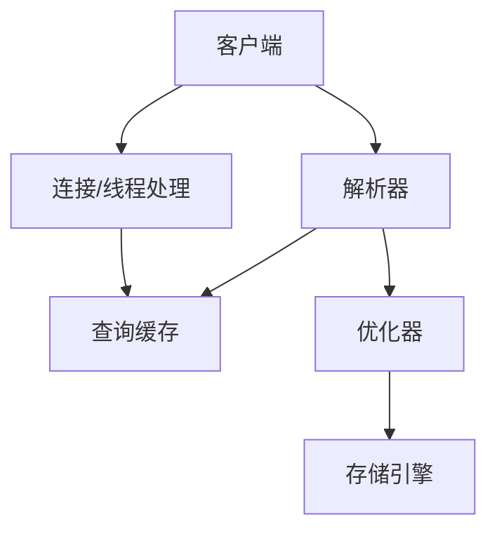

# Database notebook

### 索引

假如你现在看一本书，首先肯定会先看书的目录，看看这本书到底有哪些内容，然后通过目录找到自己感兴趣的章节进行阅读

这里的书就相当于数据库中的表，目录就相当于索引，查询表中的数据通过索引可以快速找到对应的数据

索引的数据结构是B+树，这里的B指的是balance（平衡）

```sql
//普通索引
alter table table_name add index index_name (column_list) ;
//唯一索引
alter table table_name add unique (column_list) ;
//主键索引
alter table table_name add primary key (column_list) ;
```

```sql
drop index index_name on table_name ;
alter table table_name drop index index_name ;
alter table table_name drop primary key ;
```

 建表时，LOGIN_NAME长度为100，这里用16，是因为一般情况下名字的长度不会超过16，这样会加快索引查询速度，还会减少索引文件的大小，提高INSERT，UPDATE的更新速度。

​    如果分别给LOGIN_NAME,CITY,AGE建立单列索引，让该表有3个单列索引，查询时和组合索引的效率是大不一样的，甚至远远低于我们的组合索引。虽然此时有三个索引，但mysql只能用到其中的那个它认为似乎是最有效率的单列索引，另外两个是用不到的，也就是说还是一个全表扫描的过程。

建立这样的组合索引，就相当于分别建立如下三种组合索引：

```
LOGIN_NAME,CITY,AGE
LOGIN_NAME,CITY
LOGIN_NAME
```

　　为什么没有CITY,AGE等这样的组合索引呢？这是因为mysql组合索引“最左前缀”的结果。简单的理解就是只从最左边的开始组合，并不是只要包含这三列的查询都会用到该组合索引。也就是说**name_city_age(LOGIN_NAME(16),CITY,AGE)从左到右进行索引，如果没有左前索引，mysql不会执行索引查询**。

   如果索引列长度过长,这种列索引时将会产生很大的索引文件,不便于操作,可以使用前缀索引方式进行索引，前缀索引应该控制在一个合适的点,控制在0.31黄金值即可(大于这个值就可以创建)。

### 事务

atomic原子性: 要么全部完成, 要么全部失败. 

一致性consistent:   转账前后两个金额的和应该保持不变.

isolation隔离性: 一个事务感受不到另一个事务在并发执行.

durability持久性: 数据库崩溃后可以回到之前的状态. 

commit, 事务启动后的更改被写入磁盘.

rollback, 事务启动后的更改 回到开始前的状态.

Atomic: Either all complete or all fail.

Consistent: The sum of the two amount of account  before and after the transfer should remain the same.

Isolation: One transaction cannot feel that another transaction is executing concurrently.

Durability: After the database crashes, it can return to the previous state.

commit, the changes after the transaction started are written to disk.

rollback, the changes after the transaction started return to the state before the start.

#### 什么情况会用到事务? 

事务一般用在并发操作多张表的时候使用，用于保护用户数据的完整性。或者说，事务是在对数据进行操作，并且确定两种操作同时成立时运用，这样做的目的就是保证两个操作都正确，都达到目的，只要一方出错，就会回滚数据，保证了两个操作的安全。

事务的五个状态:

active  执行中

partially committed部分提交, 最后一个操作执行完成, 但是没有变更刷新到磁盘.

fail失败的, 事务无法继续执行. 

abort中止的, 失败,回滚操作完毕, 恢复到执行前状态 

committed  从partially committed->committed, 修改过的数据都同步到磁盘后, 就是committed

脏写: 一个事务A修改了其他事务B未提交的数据. B回滚了, A写的也就没了.

脏写的问题太严重了，任何隔离级别都必须避免。其它无论是脏读，不可重复读，还是幻读，它们都属于数据库的读一致性的问题，都是在一个事务里面前后两次读取出现了不一致的情况。

脏读: 一个事务读到了其他事务未提交的数据.

不可重复读（Non-Repeatable Read）: **不可重复读指的是在一个事务执行过程中，读取到其它事务已提交的数据，导致两次读取的结果不一致**。

幻读（Phantom） **幻读是指的是在一个事务执行过程中，读取到了其他事务新插入数据，导致两次读取的结果不一致**。

mysql会自动为增删改语句加事务

不可重复读和幻读的区别在于**不可重复读是读到的是其他事务修改或者删除的数据，而幻读读到的是其它事务新插入的数据**。

`InnoDB`支持四个隔离级别（和`SQL`标准定义的基本一致）。隔离级别越高，事务的并发度就越低。唯一的区别就在于，`**InnoDB**` **在`可重复读（REPEATABLE READ）`的级别就解决了幻读的问题**。这也是`InnoDB`使用`可重复读` 作为事务默认隔离级别的原因。

### MVCC

- **版本链**

在`InnoDB`中，每行记录实际上都包含了两个隐藏字段：事务id(`trx_id`)和回滚指针(`roll_pointer`)。

1. `trx_id`：事务id。每次修改某行记录时，都会把该事务的事务id赋值给`trx_id`隐藏列。
2. `roll_pointer`：回滚指针。每次修改某行记录时，都会把`undo`日志地址赋值给`roll_pointer`隐藏列。

`InnoDB`通过`ReadView`实现了这个功能

事务并发访问同一数据资源的情况主要就分为`读-读`、`写-写`和`读-写`三种。

1. `读-读` 即并发事务同时访问同一行数据记录。由于两个事务都进行只读操作，不会对记录造成任何影响，因此并发读完全允许。
2. `写-写` 即并发事务同时修改同一行数据记录。这种情况下可能导致`脏写`问题，这是任何情况下都不允许发生的，因此只能通过`加锁`实现，也就是当一个事务需要对某行记录进行修改时，首先会先给这条记录加锁，如果加锁成功则继续执行，否则就排队等待，事务执行完成或回滚会自动释放锁。
3. `读-写` 即一个事务进行读取操作，另一个进行写入操作。这种情况下可能会产生`脏读`、`不可重复读`、`幻读`。最好的方案是**读操作利用多版本并发控制（`MVCC`），写操作进行加锁**。

### sql 

### **一、关系模型的三要素：**

- **关系数据结构**：关系模型中只包含单一的数据结构----关系，在用户看来关系模型中数据的逻辑结构是一张扁平的二维表

- **关系操作**（操作对象和结果都是集合）：

- - 查询：选择、投影、连接、并、差、交、笛卡尔积
  - 更新（插入、删除、修改）

- **关系的完整性约束**：

- - 实体完整性：主属性不能为空，主码不相等
  - 参照完整性：例如，学生（学号、姓名、专业号），专业（专业号，专业名），学生关系中的专业号需要参照专业关系中的专业号，称学生关系中的专业号是学生关系的外码，专业关系是被参照关系，学生关系为参照关系，外码与主码不一定要同名，学生关系中的外码取值要么为空值，要么为专业关系中对应专业号的值
  - 用户定义完整性：例如，学生的成绩取值范围在0~100之间

### **二、关系中涉及的基本概念**

**域**：一组具有相同数据类型的值的集合，例如：{0，1}、{男，女}

**候选码**：某一属性组的值能唯一地标识一个元组，而其子集不能的属性组

**主码**：若一个关系有多个候选码，则选定一个作为主码

**主属性**：候选码的诸属性

**非主属性（非码属性）**：不包含任何候选码中的属性

**全码**：关系模式的所有属性是这个关系模式的候选码

### mysql



#### 第一范式(1NF)

- 概念 数据表的每个字段(属性)必须是唯一的、不可分割的。
- 唯一性 比如：在一张学生信息表里不能有两个名称都是name的字段。
- 不可分割性 比如：在一张学生信息表不能出现类似name_mobile这样的字段，很明显name_mobile是可以分割成name和mobile两个字段的。

#### 第二范式(2NF)

- 概念 数据表的每条记录必须是唯一的(**主键约束**)，且非主键字段只依赖于主键。
- 唯一性 比如说：不能同时存在id ＝ 1的记录（id为主键）。
- 依赖性 比如说：在一张学生信息表（student_id为主键），不应该出现course_name(课程名称，依赖于course_id)这样的字段，因为，如果有一天，《心理健康教育》课程名要改成《心理健康教育杂谈》，就得改课程表和学生信息表的课程名称了。

#### 第三范式(3NF)

- 概念 数据表中不应该存在多余的字段，也就是说每个字段都不能由其他字段推理得到。
- 例子 比如说：学生信息表里不能同时存在province_id(省份ID)、city_id(城市ID)这两个字段，因为province_id可以由city_id推理得到

#### 逆范式

- 概念 就是不按照标准的范式去设计数据库
- 逆 在数据库的实践过程中，我们可能遇到数据量非常大的数据表，这时候去做join查询是非常损耗性能的，甚至导致数据库连接超时、挂掉等问题。所以呢，有时候就需要数据库多冗余设计，对一些字段做冗余，以避免大表之间的join。 

### lec2

relational model

##### 六个互相正交的基本属性

做笛卡尔积之前, 先尽量把别的选择操作做了. 

改名操作, 可以用来找最大账户balance.  内部实现是rename笛卡尔积, 然后

##### 四种基本操作

Set intersection   **交** 


自然连接: 一般都是笛卡尔积然后选择, 就把这两个操作组合叫做自然连接. natural join. 这是连表查询中最常见的

theta连接, 自然连接之后根据theta条件来查询.

除法操作. 当涉及到求“全部”之类的查询，常用“除法”

广义投影 , 加了选择, 运算. 

聚合函数,  

方便起见, 我们可以在聚合函数中直接rename. 

insertion就是加法, 就是并集

deletion 就是减法. 

update就是广义投影操作. 


