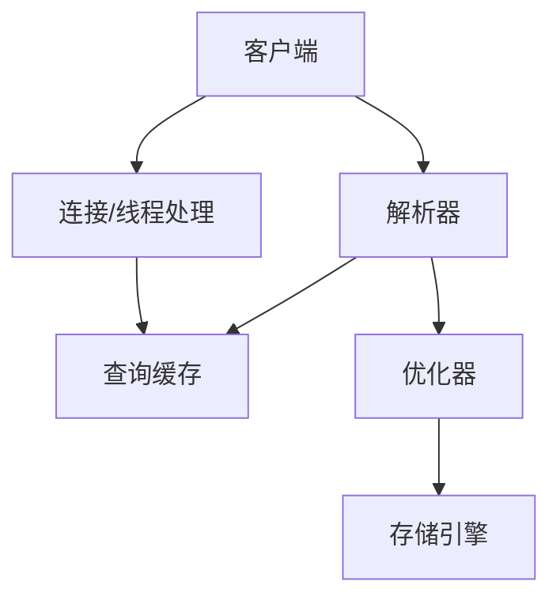

# Database notebook

作业答案： https://wenku.baidu.com/view/69529f1aaf1ffc4ffe47acd9.html

### 索引

假如你现在看一本书，首先肯定会先看书的目录，看看这本书到底有哪些内容，然后通过目录找到自己感兴趣的章节进行阅读

这里的书就相当于数据库中的表，目录就相当于索引，查询表中的数据通过索引可以快速找到对应的数据

索引的数据结构是B+树，这里的B指的是balance（平衡）

```sql
//普通索引
alter table table_name add index index_name (column_list) ;
//唯一索引
alter table table_name add unique (column_list) ;
//主键索引
alter table table_name add primary key (column_list) ;
一个主键可以有多个列.学生的名字、年龄、班级都可能重复，无法使用单个字段来唯一标识，这时，我们可以将多个字段设置为主键，形成复合主键，这多个字段联合标识唯一性
复合主键就是含有一个以上的字段组成,如ID+name,ID+phone等,而联合主键要同时是两个表的主题组合起来的。这是和复合主键最大的区别
```

```sql
drop index index_name on table_name ;
alter table table_name drop index index_name ;
alter table table_name drop primary key ;
```

 建表时，LOGIN_NAME长度为100，这里用16，是因为一般情况下名字的长度不会超过16，这样会加快索引查询速度，还会减少索引文件的大小，提高INSERT，UPDATE的更新速度。

​    如果分别给LOGIN_NAME,CITY,AGE建立单列索引，让该表有3个单列索引，查询时和组合索引的效率是大不一样的，甚至远远低于我们的组合索引。虽然此时有三个索引，但mysql只能用到其中的那个它认为似乎是最有效率的单列索引，另外两个是用不到的，也就是说还是一个全表扫描的过程。

建立这样的组合索引，就相当于分别建立如下三种组合索引：

```
LOGIN_NAME,CITY,AGE
LOGIN_NAME,CITY
LOGIN_NAME
```

　　为什么没有CITY,AGE等这样的组合索引呢？这是因为mysql组合索引“最左前缀”的结果。简单的理解就是只从最左边的开始组合，并不是只要包含这三列的查询都会用到该组合索引。也就是说**name_city_age(LOGIN_NAME(16),CITY,AGE)从左到右进行索引，如果没有左前索引，mysql不会执行索引查询**。

   如果索引列长度过长,这种列索引时将会产生很大的索引文件,不便于操作,可以使用前缀索引方式进行索引，前缀索引应该控制在一个合适的点,控制在0.31黄金值即可(大于这个值就可以创建)。

### 事务

atomic原子性: 要么全部完成, 要么全部失败. 

一致性consistent:   转账前后两个金额的和应该保持不变.

isolation隔离性: 一个事务感受不到另一个事务在并发执行.

durability持久性: 数据库崩溃后可以回到之前的状态. 

commit, 事务启动后的更改被写入磁盘.

rollback, 事务启动后的更改 回到开始前的状态.

Atomic: Either all complete or all fail.

Consistent: The sum of the two amount of account  before and after the transfer should remain the same.

Isolation: One transaction cannot feel that another transaction is executing concurrently.

Durability: After the database crashes, it can return to the previous state.

commit, the changes after the transaction started are written to disk.

rollback, the changes after the transaction started return to the state before the start.

#### 什么情况会用到事务? 

事务一般用在并发操作多张表的时候使用，用于保护用户数据的完整性。或者说，事务是在对数据进行操作，并且确定两种操作同时成立时运用，这样做的目的就是保证两个操作都正确，都达到目的，只要一方出错，就会回滚数据，保证了两个操作的安全。

事务的五个状态:

active  执行中

partially committed部分提交, 最后一个操作执行完成, 但是没有变更刷新到磁盘.

fail失败的, 事务无法继续执行. 

abort中止的, 失败,回滚操作完毕, 恢复到执行前状态 

committed  从partially committed->committed, 修改过的数据都同步到磁盘后, 就是committed

脏写: 一个事务A修改了其他事务B未提交的数据. B回滚了, A写的也就没了.

脏写的问题太严重了，任何隔离级别都必须避免。其它无论是脏读，不可重复读，还是幻读，它们都属于数据库的读一致性的问题，都是在一个事务里面前后两次读取出现了不一致的情况。

脏读: 一个事务读到了其他事务未提交的数据.

不可重复读（Non-Repeatable Read）: **不可重复读指的是在一个事务执行过程中，读取到其它事务已提交的数据，导致两次读取的结果不一致**。

幻读（Phantom） **幻读是指的是在一个事务执行过程中，读取到了其他事务新插入数据，导致两次读取的结果不一致**。

mysql会自动为增删改语句加事务

不可重复读和幻读的区别在于**不可重复读是读到的是其他事务修改或者删除的数据，而幻读读到的是其它事务新插入的数据**。

`InnoDB`支持四个隔离级别（和`SQL`标准定义的基本一致）。隔离级别越高，事务的并发度就越低。唯一的区别就在于，`**InnoDB**` **在`可重复读（REPEATABLE READ）`的级别就解决了幻读的问题**。这也是`InnoDB`使用`可重复读` 作为事务默认隔离级别的原因。

### MVCC

- **版本链**

在`InnoDB`中，每行记录实际上都包含了两个隐藏字段：事务id(`trx_id`)和回滚指针(`roll_pointer`)。

1. `trx_id`：事务id。每次修改某行记录时，都会把该事务的事务id赋值给`trx_id`隐藏列。
2. `roll_pointer`：回滚指针。每次修改某行记录时，都会把`undo`日志地址赋值给`roll_pointer`隐藏列。

`InnoDB`通过`ReadView`实现了这个功能

事务并发访问同一数据资源的情况主要就分为`读-读`、`写-写`和`读-写`三种。

1. `读-读` 即并发事务同时访问同一行数据记录。由于两个事务都进行只读操作，不会对记录造成任何影响，因此并发读完全允许。
2. `写-写` 即并发事务同时修改同一行数据记录。这种情况下可能导致`脏写`问题，这是任何情况下都不允许发生的，因此只能通过`加锁`实现，也就是当一个事务需要对某行记录进行修改时，首先会先给这条记录加锁，如果加锁成功则继续执行，否则就排队等待，事务执行完成或回滚会自动释放锁。
3. `读-写` 即一个事务进行读取操作，另一个进行写入操作。这种情况下可能会产生`脏读`、`不可重复读`、`幻读`。最好的方案是**读操作利用多版本并发控制（`MVCC`），写操作进行加锁**。

### sql 

### **一、关系模型的三要素：**

- **关系数据结构**：关系模型中只包含单一的数据结构----关系，在用户看来关系模型中数据的逻辑结构是一张扁平的二维表

- **关系操作**（操作对象和结果都是集合）：

- - 查询：选择、投影、连接、并、差、交、笛卡尔积
  - 更新（插入、删除、修改）

- **关系的完整性约束**：

- - 实体完整性：主属性不能为空，主码不相等
  - 参照完整性：例如，学生（学号、姓名、专业号），专业（专业号，专业名），学生关系中的专业号需要参照专业关系中的专业号，称学生关系中的专业号是学生关系的外码，专业关系是被参照关系，学生关系为参照关系，外码与主码不一定要同名，学生关系中的外码取值要么为空值，要么为专业关系中对应专业号的值
  - 用户定义完整性：例如，学生的成绩取值范围在0~100之间

### **二、关系中涉及的基本概念**

**域**：一组具有相同数据类型的值的集合，例如：{0，1}、{男，女}

**候选码**：某一属性组的值能唯一地标识一个元组，而其子集不能的属性组

**主码**：若一个关系有多个候选码，则选定一个作为主码

**主属性**：候选码的诸属性

**非主属性（非码属性）**：不包含任何候选码中的属性

**全码**：关系模式的所有属性是这个关系模式的候选码

### mysql



#### 第一范式(1NF)

- 概念 数据表的每个字段(属性)必须是唯一的、不可分割的。
- 唯一性 比如：在一张学生信息表里不能有两个名称都是name的字段。
- 不可分割性 比如：在一张学生信息表不能出现类似name_mobile这样的字段，很明显name_mobile是可以分割成name和mobile两个字段的。

#### 第二范式(2NF)

- 概念 数据表的每条记录必须是唯一的(**主键约束**)，且非主键字段只依赖于主键。
- 唯一性 比如说：不能同时存在id ＝ 1的记录（id为主键）。
- 依赖性 比如说：在一张学生信息表（student_id为主键），不应该出现course_name(课程名称，依赖于course_id)这样的字段，因为，如果有一天，《心理健康教育》课程名要改成《心理健康教育杂谈》，就得改课程表和学生信息表的课程名称了。

#### 第三范式(3NF)

- 概念 数据表中不应该存在多余的字段，也就是说每个字段都不能由其他字段推理得到。
- 例子 比如说：学生信息表里不能同时存在province_id(省份ID)、city_id(城市ID)这两个字段，因为province_id可以由city_id推理得到

#### 逆范式

- 概念 就是不按照标准的范式去设计数据库
- 逆 在数据库的实践过程中，我们可能遇到数据量非常大的数据表，这时候去做join查询是非常损耗性能的，甚至导致数据库连接超时、挂掉等问题。所以呢，有时候就需要数据库多冗余设计，对一些字段做冗余，以避免大表之间的join。 

### Lec2

relational model

##### 六个互相正交的基本属性

做笛卡尔积之前, 先尽量把别的选择操作做了. 

改名操作, 可以用来找最大账户balance.  内部实现是rename笛卡尔积.

关系代数的投影是集合操作, 自动去重. sql要加distinct.

##### 四种基本操作

Set intersection   **交** 

自然连接: 一般都是笛卡尔积然后选择, 就把这两个操作组合叫做自然连接. natural join. 这是连表查询中最常见的

theta连接, 自然连接之后根据theta条件来查询.

除法操作. 当涉及到求“全部”之类的查询，常用“除法”

广义投影 , 加了选择, 运算.

聚合函数

方便起见, 我们可以在聚合函数中直接rename. 

insertion就是加法, 就是并集

deletion 就是减法. 

update就是广义投影操作. 

### Lec3 SQL1

1975年IBM发明.

ANSI (American National standard institute)提出标准, 从SQL86到SQL99.

SQL92 在商业化软件用的最多. 

SQL92和99标准分为4级,  但是没有DBMS 产品达到第四级full SQL level.

因为oracle 要保证自己的unique， 不可替代性, 不能容易被替换掉. 所以故意20%和别人不一样。 

##### 三种

DDL 

```sql
Create view, drop view
Create index, ..
Create table , alter table
Create trigger 
```

DML 

select , insert , delete , update 

DCL控制

Grant, revoke 权限控制

#### DDL

创建表

可以用check 来检查属性

primary key 可以设置到列名后面， 或者在声明所有列后再设置

删除表

用drop， 会删除数据和schema， delete是删除数据内容

alter table

改变schema， 新增列， 改变属性的类型， 改变完整性约束。

##### 创建索引

```sql
create index <i-name> on <table-name>(attribute)
create unique index 
```


#### DML

select 对应的是投影操作

from 多个表对应的是笛卡尔积

select 大小写不敏感。 支持下划线。 

distinct 去重 ， all 不做去重，默认是all。 

where 可以用between and 

学习这些还是看作业实践一下， 有例子就好很多 。

改名， 可以简化。 还有自己和自己比较的时候必须rename分裂成两个实例

##### 字符串操作

`% 匹配字符串， 类似于 *`

`_ 匹配单个字符，类似于？`

`select “abv” || name`  可以实现拼接。

order by 根据字母序排序， 默认升序， desc 是降序。 可以多个属性排序， 比如可以： ` orderby a, b desc, c` 

##### 集合操作

并union  交 intersect 补 except ， 后面加all表示 retain all duplicates。 

聚合函数

例如取平均值 `select avg(balance) group by branch_name ` 

聚合函数 `  count(name) tot_num  `可以直接跟着重命名，不用as.还可以 `count(distinct name)`  先去重再count 。

having和where 后面都是布尔表达式 ， having 是分组完成之后才能做的  ， where是分组完成之前的。 先做的放在where。 

用法

group by 如果有两个并列最大, 就会出错. 

##### 执行顺序

from -> where-> group -> having -> select -> distinct - > order by

如果聚合的值要判断， 就having 

大部分认为null是0 ， count可能会把null计入。 

#### 视图

`create view <v_name> as select c1,c2 from ... ` 启动应用的时候加载到内存， 调用的时候比较快。

 建立在单个基本表上的视图，且视图的列对应表的列，称为“行列视图”。 可以写入.  多张表的视图不能写入. 

View 是虚表，对其进行的所有操作都将转化为对基表的操作。

查询操作时，VIEW与基表没有区别，但对VIEW的更新操作有严格限制，如只有行列视图，可更新数据。

### Lec4 SQL2

#### 嵌套查询

from子句中

```sql
where col not in (select col from table1)
-- 甚至还可以tuple 
where (br, col) in (select br, col from xxxx)
```

```sql
-- Find the account_number with the maximum balance for every branch. 每组求最大值, 比较复杂
WHERE balance >= max(balance) 
-- 这样写是不行的,  因为还没分组, 查出来的是整个表最大的, 而不是每个branch最大的. 

SELECT account_number, max(balance) 
FROM account  -- 这样写也不行

-- 表的自比较,需要重命名,答案如下
SELECT account_number AN, balance 
FROM account  A 
WHERE balance >= (SELECT max(balance)               FROM account B
WHERE A.branch_name = B.branch_name)
ORDER by balance
```
some

some是sql保留字, 就是一个数字不能大于一个集合, some就是说比其中一个大就行.  

some可能大于是ture, 小于也是true 等于也是true.   大于全部要用all 关键字

```sql
WHERE assets > some
(SELECT assets 
 FROM branch 
 WHERE branch_city = ‘Brooklyn’)
```

select语句中没有关系代数的除法操作, 要依靠 not exists, except 组合实现. 

#### unique 关键字

找到最多只有一个的数据.

`where unique xx`

Oracle 8 and SQL Server 7 do not support unique and not unique

#### 临时表

(不管是否被引用，导出表(或称嵌套表)必须给出别名) 

```sql
from (select  xxx )
as result (branch_name,avg_bal)
```

#### with语句

作为select 前面的一些准备. 比如可以产生临时表

这整个是sql语句

```sql
with tmptable(value) as 
  select xx 
  from xx 
select bb
from tmptable
```

with 可以有多个, 但是只有一个主语句会用这些with产生的临时表, 主语句结束后别的语句不认. 

#### 删除

在同一SQL语句内，除非外层查询的元组变量引入内层查询，否则层查询只进行一次。

#### 插入

也可以跟select 语句, 把select结果插入到另一个表. 

#### 更新

update语句, 可以用case关键字.

```sql
UPDATE account 
SET balance = case 
when  balance <= 10000 
then balance * 1.0 
else balance * 1.06 
end
```

#### 连接

inner join 内连接就是自然连接, 两边都要有. 

left outer join左外连接, 产生结果行数等于左边的行数, 找不到就设置为null

full outer join , 左外连接的结果 UNION 右外连接的结果.

自然连接：*R* natural {inner join, left join, right join, full join} *S*  把公共属性去重.

还可以非自然连接：

```sql
R{inner join, left join, right join, full join} S
on <连接条件判别式>
using (<同名的等值连接   属性名>) 
```

Key word *Inner*, *outer* is optional, 是可以省略的

**Natural join:** 以同名属性相等作为连接条件

**Inner join**：只输出匹配成功的元组

**Outer join：**还要考虑不能匹配的元组

 非自然连接，容许不同名属性的比较，且结果关系中不消去重名属性, aka, 结果可能会有同名的属性.

使用using的连接类似于natural连接，但仅以using列出的公共属性为连接条件. 

Find the names of courses that have maximum average score. 

可能有多个课都一样高, 就要用 in 

```sql
SELECT course_name 
FROM course 
WHERE course_no in   -- 可能有多个课都一样高
    (SELECT course_no 
	FROM study 
	GROUP BY course_no 
	HAVING avg(score) >= all 
		(SELECT avg(score) 
		 FROM study 
  		 GROUP BY course_no)) 
```

### lec5 高级sql

create type

create new domain ,  domain可以加限制条件,

```sql
create domain dollars as numeric(2,2) not null;
create table employee (
	eno char(10) primary key,
    salary dollars
);
```

大对象类型 blob(20MB)  clob 最大10KB

#### 外键

是作为integrity constraint.

FOREIGN KEY 约束用于预防破坏表之间连接的行为。

FOREIGN KEY 约束也能防止非法数据插入外键列，因为它必须是它指向的那个表中的值之一。

Assume there exists relations *r* and *s*: *r*(*A*, *B*, *C*), *s*(*B*, D), we say attribute *B* in *r* is a foreign key from relation *r*, and *r* is called *referencing relation* (参照关系), and *s* is called *referenced relation* (被参照关系)*.* 

ØE.g., 学生(学号, 姓名, 性别, 专业号, 年龄) --- 参照关系 

​    专业(专业号, 专业名称) --- 被参照关系 (目标关系) 

​    其中属性专业号称为关系*学生*的外码。 

Ø*Account*(*account-number*, *branch-name*, *balance*) --- 参照关系 

 *Branch*(*branch-name*, *branch-city*, *assets*) --- 被参照关系 

参照关系中外码的值必须在被参照关系中实际存在，或为null. 

 专业删除的时候, 要看学生, 不能随意删除. 要么 rejected as an error, 要么 tuples in *t*2 that references *t*1 must themselves be deleted (cascading deletions are possible). 

学生插入的时候, 要检查在专业中存在.  

cascading action 

```sql
create table account(...foreign key( br) references brtable
on delete cascade
on update cascade,
                     ...
)
```

如果删除brtable中的tuple, 那么account中也会删除.  除了cascade还可以set null 或者 set default.

Note: Referential integrity is only checked at the end of a transaction !!  因为可能有环.

#### 断言

```sql
 CREATE ASSERTION <assertion-name> 
  CHECK <predicate>; 
```

sql没有说都存在, 只能用 not exist 嵌套 not exist.

#### 触发器

account update 后, 就执行动作

```sql
CREATE TRIGGER overdraft-trigger after update on account 
	referencing new row as nrow for each row 
	-- new row 是保留关键字, 表示改的那一行. 
	when nrow.balance < 0 
	  begin atomic -- 要么全部执行, 要么全部不执行. 
		insert into borrower 
			(select customer-name, account-number from depositor 
	 		 where nrow.account-number = depositor.account-number) 
	    	insert into loan values 
			(nrow.account-number, nrow.branch-name, – nrow.balance) 
	    	update account set balance = 0 
			where account.account-number = nrow.account-number 
	    end 
```

- Triggering event can be insert, delete or update. 

- Triggers on update can be restricted to specific attributes：

E.g., Create trigger *overdraft-trigger*

​      after update of *balance* on *account …* 

- Values of attributes before and after an update can be referenced: 

Referencing old row as: for deletes and updates 

Referencing new row as: for inserts and updates 

##### 语句触发器

多行数据修改

`for each statement` instead of `for each row` 

 `referencing old table` or `referencing new table` to refer to temporary tables (called *transition tables*) containing the affected rows 

 Can be more efficient when dealing with SQL statements that update a large number of rows 

##### External World Actions 

Triggers cannot be used to directly implement external-world actions

但是 Triggers can be used to record actions-to-be-taken in a separate table. Have an external process that repeatedly scans the table, carries out external-world actions and deletes action from table. 

例子如下:  这就是做一次补货

```sql
CREATE TRIGGER reorder-trigger after update of level on inventory 
	referencing old row as orow, new row as nrow 
   	for each row 
		when nrow.level <= (select level 
			                      from minlevel 
			                      where minlevel.item = nrow.item) 
                   and orow.level > (select level 
			                      from minlevel 
		                                   where minlevel.item = orow.item)  -- 容易忘记判断orow, 新一次低于了就补货. 不能每次都低于都补货. 
	begin 
		insert into orders 
			(select item, amount 
			 from reorder 
		              where reorder.item = orow.item) 
	end 
```

sql server  Inserted, deleted 相当于前法的*nrow* (称为过渡表, transition table)和*orow* 

```sql
CREATE TRIGGER overdraft-trigger on account
 for update as 
 if inserted.balance < 0 
```

#### grant

所谓Role，可以认为是一个权限的集合，这个集合有一个统一的名字，就是Role名，你可以为多个账户赋予统一的某个Role的权限，而权限的修改可以直接通过修改Role来实现，而无需每个账户逐一GRANT权限，大大方便了运维和管理。

Role可以被创建，修改和删除，并作用到其所属于的账户上。

https://developer.aliyun.com/article/60654

如果user1将 select access 通过granted by current role 给另一个user2 授予, 即使user1的role被收回, user2还是可以拥有这个role.

#### Authorization

grant 可以传递,  从DBA为root 形成一个authorization graph

##### Privileges in SQL 

增删改查, 还有reference. 

`grant select on branch to U1 with grant option`  with grant option 可以传递 , gives U1 the select privileges on *branch* and allows U1 to grant this privilege to others. 

回收权限 

REVOKE <privilege list> ON <table | view> 

​     FROM <user list> [restrict | cascade] 

```sql
Revoke select on branch from U1, U3 cascade; // U1赋予别人的也都会回收
Revoke select on branch from U1, U3 restrict;
```

authorization 不会控制到每一行, 资源消耗太大. 

##### audit trails 

E.g., `audit table by scott by access whenever successful` ---- 审计用户scott每次成功地执行有关table的语句 (create table, drop table, alter table)。 

例子2 `audit delete, update on student` --- 审计所有用户对student表的delete和update操作。 

q怎样看审计结果：

Ø审计结果记录在数据字典表: sys.aud$中，也可从dba_audit_trail, dba_audit_statement, dba_audit_object中获得有关情况。

Ø上述数据字典表需在DBA用户（system）下才可见。

#### 嵌入式sql

:*V_an*, :*bn*, :*bal*是宿主变量，可在宿主语言程序中赋值，从而将值带入SQL。宿主变量在宿主语言中使用时不加:号。

#### ODBC

```c
  if (error == SQL_SUCCESS) { 
	  SQLBindCol(stmt, 1, SQL_C_CHAR, branchname,80, &lenOut1); 
	  SQLBindCol(stmt, 2, SQL_C_FLOAT, &balance, 0, &lenOut2); 
	  /* 对stmt中的返回结果数据加以分离，并与相应变量绑定。第1项数据转换为C的字符
	  类型，送变量branchname(最大长度为80)， lenOut1为实际字符串长度（若＝-1代表
	  null），第2项数据转换为C的浮点类型送变量balance中 */ 
	  while ( SQLFetch(stmt) >= SQL_SUCCESS) { /* 逐行从数据区stmt中取数据，放到绑定变量中 */ 
	  printf (“ %s  %d\n”, branchname, balance); 
            /*  对取出的数据进行处理*/       … …          } 
				      }   …… 
	} 
	  SQLFreeStmt(stmt, SQL_DROP);  /* 释放数据区*/ 
```

`ROLLUP`是`GROUP BY`子句的扩展。 `ROLLUP`选项允许包含表示小计的额外行，通常称为超级聚合行，以及总计行。 通过使用`ROLLUP`选项，可以使用单个查询生成多个[分组集](http://www.yiibai.com/sql/sql-grouping-sets.html)。


### Lec6 实体关系模型

<<<<<<< HEAD
#### Entity Sets

实体是一个对象， 可以是具体的，也可以是抽象的。

实体有属性attributes。 一个实体集包含多个同类实体

domain： 就是值域

一个联系集表示二个或多个实体集之间的关联 

#### keys

super key,
=======
super key
>>>>>>> 11b390e630397a3cf9b7cf4c4c1f6bca99f36e56

candidate key , 最小的super key, 小一个就不能作为super key

有箭头表示一对一, 没有箭头表示一对多

#### 弱实体集

还贷登记表 payment(pay-num, pay-date, pay-amount). 假设为了清楚起见，pay-num按对应的每项贷款分别编号(都从1, 2, 3 …开始), 这样，pay-num就不是码，并且该实体集没有码。故payment是弱实体集。 pay-num is discriminator or partial key (分辨符或部分码). 

#### E-R 设计

若一个对象只对其名字及单值感兴趣，则可作为属性，如性别；若一个对象除名字外，本身还有其他属性需描述，则该对象应定义为实体集。如电话, 部门. 
一个对象不能同时作为实体和属性. 
一个实体集不能与另一实体集的属性相关联，只能实体与实体相联系. 

(二个对象之间发生的动作 --- 用“relationship set”表示). 


例子， 画 e-r 图， 转化为relational schema。

联系可以具有描述性属性。
二元联系集就是涉及两个实体集的联系，及数据库中的大部分连线机都是二元的，但是有一些实体集会多于两个。
参与联系集的实体集，它的数目也被叫做度。
复合属性它可以分为多个简单属性。
单值属性和多值属性，比如一个员工可以有一个或多个电话号码，所以就不同的员工实体在电话号码这个属性上就会有不同的值，这个属性就叫做多值属性。比方说一个员工可能有多个亲属。
映射基数就是说一个实体通过一个连续机能和多少个实体相关联。
派生属性就是说这个属性的值可以从别的相关属性或实体中派生出来，比方说有一个贷款数量这个属性，那就可以从其他的数量当中计算出来。用来计算派生属性的就是基属性。派生属性的值不存储，但在需要的时候可以被计算出来。
如果一个属性可以把不同的实体区分开，那它就是一个超码。
如果一个超码他任意的真子集都不能成为超码，那这样的最小超码就叫做候选码。
主码应该选择从不变化或者极少变化的属性。 
联系集的主码怎么选择呢？就比方说如果是多对多的话，那就可以把两个实体集的主码共同组成，如果是多对1的话就选那个对一一一对应的那个主码。
参与约束。
如果每个实体都参与到联系集的至少一个联系中，我们称实体集全部参与联系，即如果实体集中只有部分实体参与，到联系集的联系中，就叫做部分参与联系集。

#### 图符号

图是怎么画的呢？
画矩形表示实体set
椭圆表示属性
菱形表示联系set
双椭圆表示多指属性
虚线椭圆表示派生属性，
双线就表示一个实体集全部参与到联系集中。
双矩形表示weak实体集。
双菱形就表示标识型联系。
箭头可以表示只能是1对1或者多对1。箭头方向指的是1。
如果是1对1的话，那联系集出发的两条线都应该是箭头，一个箭头指向一个实体集。
如果有一些属性和联系集也是相关联的，那我们也要把这些属性用线段连在联系集上。

在菱形和矩形连线上面就可以标注上角色，比方说employee连个线连到它联系集上，然后可以标注一个worker。

在联系集外最多只允许有一个箭头，因为一个非二元，联系集外如果有两到更多个箭头的话，可能会存在两种解释，然后存在混。
双线就表示实体集中的每一个实体都参与到联系集的至少一个联系当中。
或者你也可以在线上标注一下，来指定最小的映射基数到最大的映射基数

#### 怎么看用实体还是用属性？

一个常见的错误是把一个实体集的主码作为另一个实体集的属性，比方说把客户的名字作为贷款的属性是不正确的。，可能需要一个借贷人这个联系。这样可以明确的表示出两者之间的关系。
还有一个常见的错误是把实体集的主码属性作为联系集的属性。事实上在联系的表示中，已经隐含了这些主码属性。
怎么判断是用实体集还是用联系集呢？。当描述发生在实体之间的行为的时候，就是一种联系集
数据库中的联系通常都是二元的，但其实也可以用多元的联系集。

1对1或者一对多联系集的属性。他可以放到一个参与该联系的实体集中。这样联系集就不用存储这属性。

### 弱实体集

就是说一个实体集，他没有足够的属性来形成主码。 主码的实体集就叫做强实体集。

弱实体集必须与另一个称为标识实体集或叫identifying  Entity set。和他关联才有意义，所以就是存在依赖于标识实体集。标识实体及 拥有它所标识的弱实体集把这它们之间的联系叫做标识行联系。
要实行联系，他是从弱实体集到标识实体集的，多对一联系，而且弱实体集全部参与联系。
若实体集它也需要一个分辨符，然后这个分辨符也叫做这个实体集的部分码
弱实体集的主码由标识实体集的主码和弱实体集的部分码共同组成。

#### 聚集

聚集是一种抽象，通过这种抽象联系被当做高层的实体来看待。就是可以在一个联系和另一个实体中间再建立一个联系。把联系集看作一个高层实体集。

对于一个多对多的二元联系，主码应该是参与实体集的主码属性的并集。
一个1对1的二元联系集，任何一个参与实体集的主码都可以作为联系的主码。
对于多对一的二元联系集，主码应该是联系集中多的那一边的实体集的主码。
对于N元联系集，如果连接到它的边没有箭头，那么主码就是所有参加实体集的主码属性的并集。
如果有一个边有一个箭头的话，那就除去那一边的实体集的主码属性，其他的取并集作为联系的主码。

#### 4月19日


B- C 范式

数字越大， 规范化程度越高， 冗余程度更低。


BC 范式一定是第三范式， 第三范式不一定是BC范式。 可能是别的， 

BC范式可能丢掉函数关系， 第三范式因为不分解所以保留。

最精简集合。

